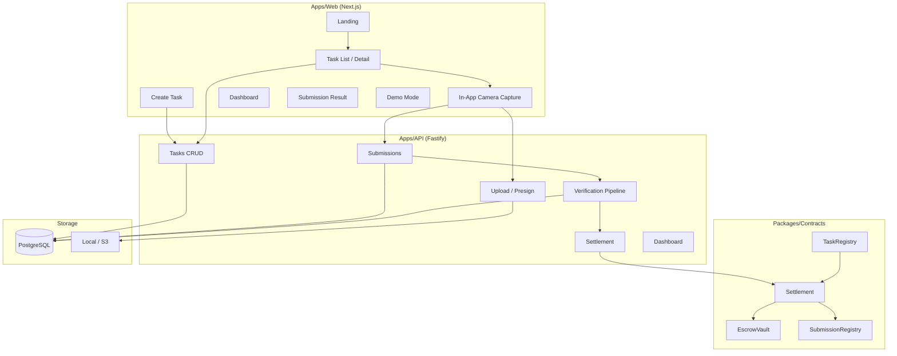

# veri.fi

**AI-verified proof of real-world actions on Creditcoin**

---

## Web-only Quick Start (hackathon demo)

The main hackathon demo runs with **just the web app**. No database or separate API server required.

1. **Copy env (optional but recommended)**  
   ```bash
   cp apps/web/.env.example apps/web/.env.local
   ```  
   You can run without this; the app will use defaults (mock verification, mock settlement).

2. **Install and run**  
   ```bash
   pnpm install
   pnpm dev:web
   ```  
   Open [http://localhost:3000](http://localhost:3000).

3. **Behavior without env**  
   - **AI verification**: Falls back to mock mode if `DEEPINFRA_API_KEY` / `OPENAI_API_KEY` are not set.  
   - **Settlement**: Falls back to mock/demo mode if `VERIFIER_PRIVATE_KEY` or `NEXT_PUBLIC_VERIACT_ESCROW_ADDRESS` are not set.  
   - **Data**: Tasks and submissions are stored in memory and **reset when the server restarts**.

**Optional — Supabase backend:** To persist tasks and submissions, set `NEXT_PUBLIC_SUPABASE_URL`, `NEXT_PUBLIC_SUPABASE_ANON_KEY`, and `SUPABASE_SERVICE_ROLE_KEY` in `apps/web/.env.local`, run the SQL in `supabase/schema.sql` in your Supabase project (SQL Editor), create the **proof-images** storage bucket if needed (Dashboard → Storage), then restart the app. With Supabase configured, proof images are stored in Storage and the seed task has a UUID (use **Explore Tasks** to open it).

For full stack (Fastify API, PostgreSQL, contracts), see **Local setup** below.

---

## Problem

Proving that a real-world action happened (e.g. “this EV charger is operational”, “this store is open”) is hard to automate and trust. Manual checks don’t scale; pure self-reports are easy to game.

## Solution

**veri.fi** turns real-world actions into **programmable proof**:

1. **Sponsors** create verification tasks and escrow rewards on Creditcoin (testnet).
2. **Participants** accept a task and capture proof using the **in-app camera** (photo or short video), with GPS + timestamp.
3. The **backend** verifies each submission with a weighted score: location, time, visual (object/scene), liveness, and anti-fraud.
4. If the score meets the task’s threshold, the **smart contract** releases the reward to the participant.
5. Everyone sees the task as verified and the reward as paid.

## Architecture



## Tech stack

- **Monorepo**: pnpm workspaces  
- **Frontend**: Next.js 14 (App Router), TypeScript, Tailwind, Framer Motion, React Hook Form + Zod, viem + wagmi  
- **Backend**: Fastify, Prisma, PostgreSQL  
- **Contracts**: Solidity (Hardhat), TaskRegistry, EscrowVault, SubmissionRegistry, Settlement  
- **Shared**: `@verifi/shared` (types, schemas, constants)

## Local setup

### Prerequisites

- Node.js 18+
- pnpm 9
- PostgreSQL (or use a cloud DB URL)
- (Optional) Hardhat node for local chain

### 1. Install dependencies

```bash
pnpm install
```

### 2. Build shared package

```bash
pnpm --filter @verifi/shared build
```

### 3. Database

```bash
# From repo root
pnpm db:push
pnpm db:seed
```

Or from `apps/api`:

```bash
cd apps/api && pnpm exec prisma db push && pnpm exec tsx prisma/seed.ts
```

### 4. Environment

- `apps/api`: copy `apps/api/.env.example` to `.env` and set `DATABASE_URL`, optional `VERIFIER_PRIVATE_KEY` and contract addresses.
- `apps/web`: copy `apps/web/.env.example` to `.env.local` and set `NEXT_PUBLIC_API_URL` if needed.
- `packages/contracts`: copy `.env.example` to `.env` for deploy keys if using testnet.

### 5. Run

**Terminal 1 – API**

```bash
pnpm dev:api
```

**Terminal 2 – Web**

```bash
pnpm dev:web
```

Open [http://localhost:3000](http://localhost:3000).

### 6. (Optional) Local chain + contracts

```bash
# Terminal: start local node
cd packages/contracts && pnpm exec hardhat node

# Deploy
pnpm contracts:deploy
# Then set SETTLEMENT_ADDRESS, TASK_REGISTRY_ADDRESS, etc. in apps/api/.env
```

## Run commands summary

| Command | Description |
|--------|-------------|
| `pnpm install` | Install all deps |
| `pnpm dev` | Run web + API in parallel |
| `pnpm dev:web` | Next.js on :3000 |
| `pnpm dev:api` | Fastify API on :3001 |
| `pnpm db:push` | Prisma push schema |
| `pnpm db:seed` | Seed tasks + users |
| `pnpm build` | Build all packages |
| `pnpm test` | Run all tests |
| `pnpm contracts:compile` | Compile Solidity |
| `pnpm contracts:deploy` | Deploy contracts |

## Demo walkthrough (judge-friendly)

1. **Landing**  
   Go to [http://localhost:3000](http://localhost:3000). Click **Explore Tasks** or **Demo Mode**.

2. **Demo mode** (`/demo`)  
   - Connect wallet (participant).  
   - Use the seeded task “Verify EV Charger at Station A”.  
   - Click **Open Camera — Capture Proof**.  
   - Allow camera + location.  
   - Capture a photo → **Submit proof & verify**.  
   - See “Verifying…” then score breakdown and “Verified & paid” (or “Rejected” if below threshold).  
   - Click **View submission** to see the submission result page.

3. **Create task** (`/create`)  
   - Connect as sponsor.  
   - Use **Prefill: EV Charger Check** or fill the form.  
   - Submit → redirect to task detail.

4. **Task detail** (`/tasks/[id]`)  
   - See task, map link, and **Open Camera** to capture proof (same flow as demo).

5. **Dashboard** (`/dashboard`)  
   - **My created tasks**, **My submissions**, **Verified actions** with status badges.

## Verification pipeline (MVP)

Scores in `[0, 1]`:

- **Location**: distance to target vs allowed radius (decay outside).
- **Time**: how fresh the capture is.
- **Visual**: heuristic by expected object label (e.g. “EV charger” → 0.85); pluggable for vision API later.
- **Liveness**: session token + media type (video vs photo).
- **Anti-fraud**: evidence hash uniqueness, location/timestamp presence.

**Final score** = weighted sum (default: location 0.3, time 0.15, visual 0.3, liveness 0.1, anti-fraud 0.15).  
**Accept** if score ≥ task `confidenceThreshold`.

## Why Creditcoin

- **Escrow**: rewards held on-chain until verification passes.  
- **Settlement**: verifier backend calls Settlement contract to release to participant.  
- **Auditability**: task metadata hash, evidence hash, and verification result on-chain.  
- **Reputation**: optional ReputationRegistry for success/failure counts (foundation for future trust scoring).

## Hackathon track fit

- **DePIN**: verify physical infrastructure (e.g. EV chargers, sensors, coverage).  
- **RWA**: attest real-world state (e.g. store open, event attendance, asset condition).

## Future work

- Vision API / lightweight model for real object detection.  
- Perceptual hash + duplicate detection across submissions.  
- ReputationRegistry integration and trust multiplier in scoring.  
- Creditcoin mainnet + production RPC.  
- PWA + offline-friendly capture flow.

## Screenshots

_Add screenshots of: landing, task list, task detail + camera, submission result, dashboard._

---

**veri.fi** — Turn real-world actions into programmable proof.
